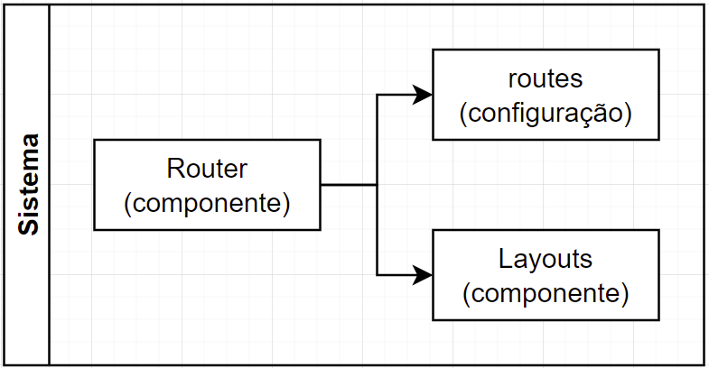

# Router




> Este projeto tem como objetivo implementar um sistema de rotas para o reactjs de maneira que cada rota se monte com base nas configurações pré estabelecidas no arquivo src/routes.

## 🚀 Instalando

Para instalar o projeto, siga estas etapas:

```
yarn
```

## ☕ Iniciando

Para iniciar o projeto, siga estas etapas:

```
yarn start
```
